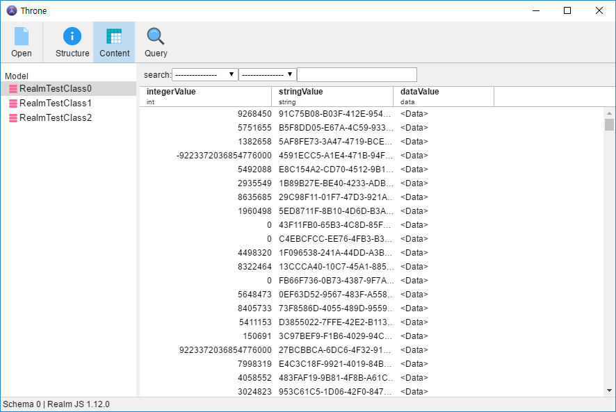
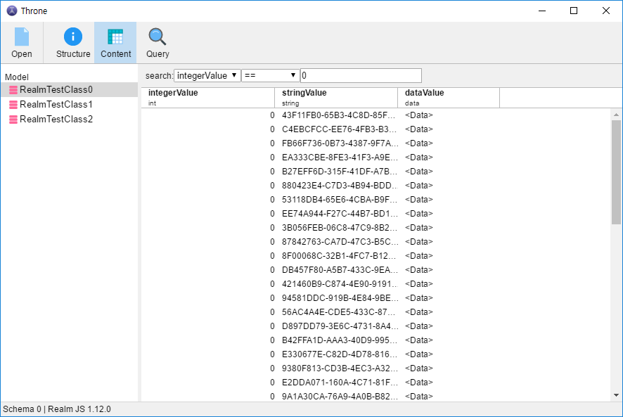
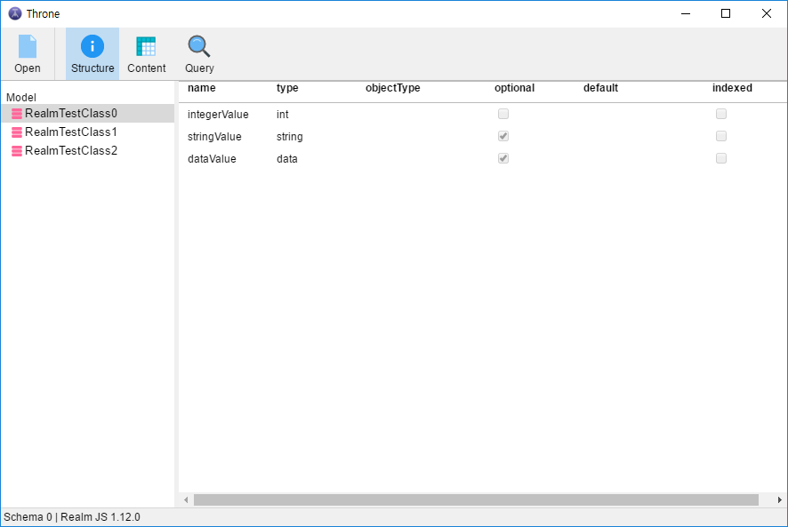
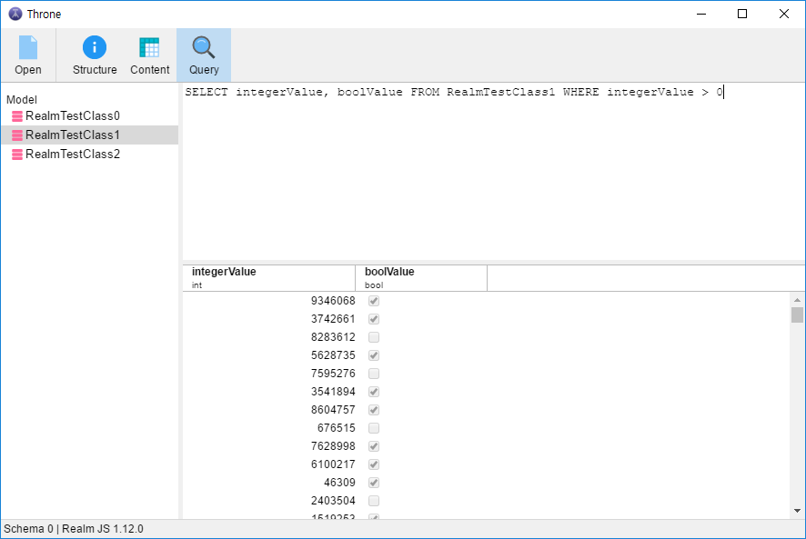

# Throne


Throne is Realm browser made with electron

[Download](https://github.com/hahnlee/throne/releases)

If you find first-party realm studio then, follow these links!
* [Realm Browser OSX](https://github.com/realm/realm-browser-osx/) for macOS
* [Realm Studio](https://realm.io/kr/products/realm-studio/) for macOS, Windows, Linux

# Feature
## Filtering



## Structure


## Query
> NOTE: Throne support only few select query and every sql operator must uppercase



# Roadmap
## 0.2.0
* Support Edit row
* TestCase!
* Support Linux
* Support macOS
* Support Windows installer
* Support Update

# Third-Party Licenses
Check out [NOTICE.md](./NOTICE.md) :)

# Logo
By Artem Kovyazin Purchased from [the noun project](https://thenounproject.com/lh_vison/settings/icon-history/129045644/)

# [License](./LICENSE)
```
Copyright 2017-2018 Han Lee

Licensed under the Apache License, Version 2.0 (the "License");
you may not use this file except in compliance with the License.
You may obtain a copy of the License at

    http://www.apache.org/licenses/LICENSE-2.0

Unless required by applicable law or agreed to in writing, software
distributed under the License is distributed on an "AS IS" BASIS,
WITHOUT WARRANTIES OR CONDITIONS OF ANY KIND, either express or implied.
See the License for the specific language governing permissions and
limitations under the License.
```

> **NOTE**: This product includ [realm-js](https://github.com/realm/realm-js) and realm-js follows the U.S. export control laws and policies.
